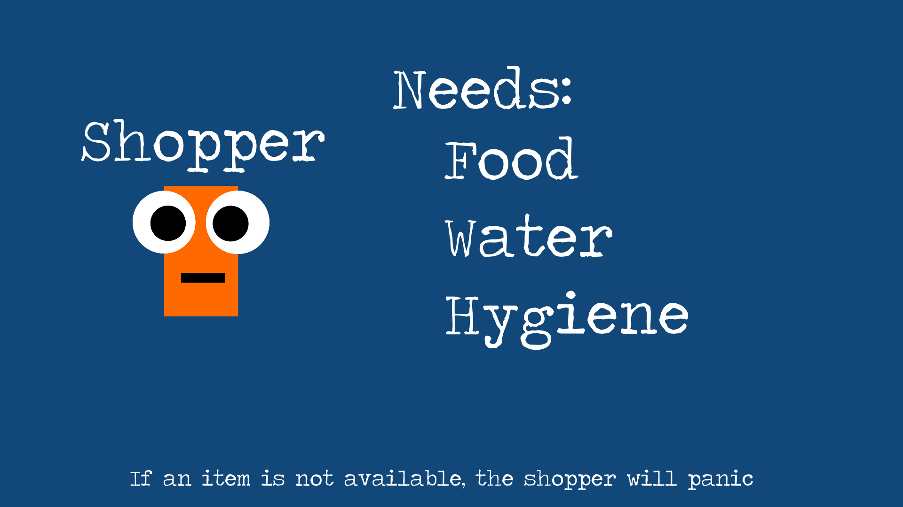

# Panic Buying Simulator
### Project created for educational YouTube video
YouTube: https://www.youtube.com/watch?v=ZSdnssSc2XQ&t=220s

Software simulates agents panic buying from a store, and tracks associated metrics. Developed during COVID-19 as an educational resource during an epidemic of panic buying in the UK.

# Gallery

